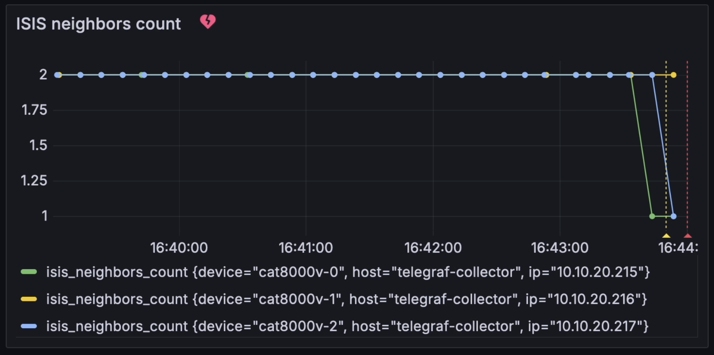
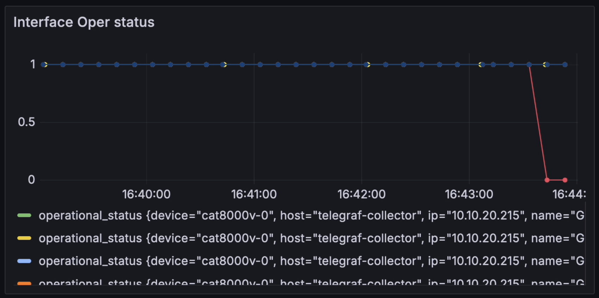
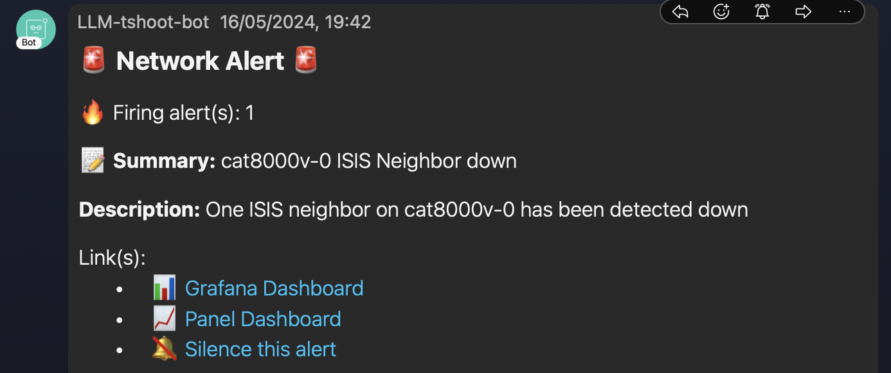
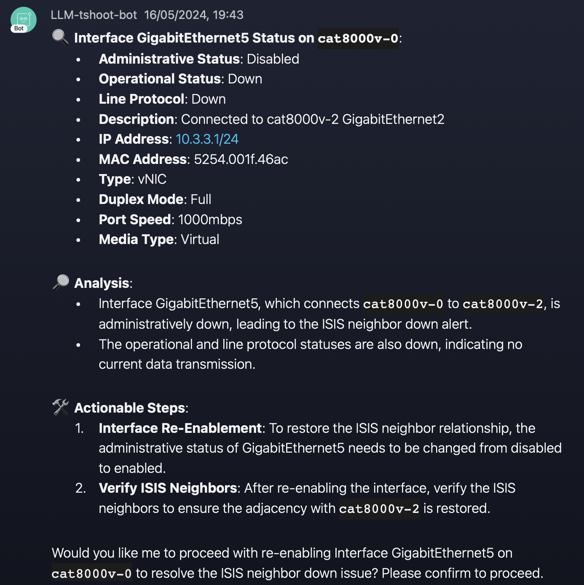
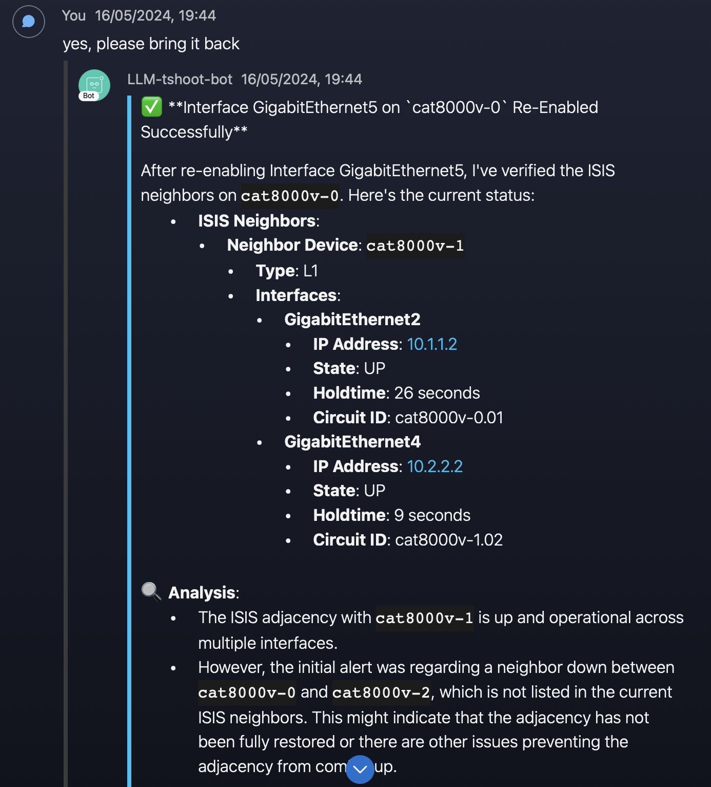
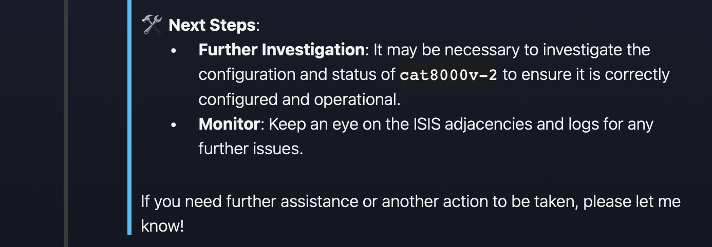

# AI-Network-Troubleshooting-PoC


This demo is built to showcase how you AI might assist you in troubleshooting network issues.

The components used by this demo are:

- Virtual IOS-XE devices running ISIS.

  - The [CML Devnet sandbox](https://developer.cisco.com/site/sandbox/) was used to build the lab.
  - Sandbox DevBox VM `10.10.20.50`, `developer`/`C1sco12345`)

- [ncpeek.](https://github.com/jillesca/ncpeek) A python netconf client used for telegraf.
- TIG stack with docker `20.10+` 🐳
  - Telegraf grabs telmetry data from network devices.
  - Grafana kicks a webhook when an alarm is detected. 🚨
- FastAPI.
  - Host the LLM.
  - Interacts with network devices & frontend.
- PyATS. Provides a framework to interact with network devices. 🛠️
- [Webex_bot](https://github.com/fbradyirl/webex_bot) use to interact with the LLM. 🤖
- OpenAI LLM. 🧠
  - `gpt-4-turbo-preview` was used. 🚀

## 🎬 Demo

For this demo [one alarm was created.](grafana/config/alerts.yaml)

```bash
if avgNeighbors(30sec) < avgNeighbors(30min) : send Alarm​
```

> When the average number of ISIS neighbors in a lapse of 30 second _**is less than**_ the average number of ISIS neighbors in a lapse of 30 minutes, the alarm will trigger a webhook for the LLM.

This signal that a stable ISIS neighbor that was working on the last 30 minutes was lost, and allows to work with `N` number of ISIS neighbors.

## 🛠️ Prepare Demo

### 🔑 Environment variables

Environment variables are injected through the use of [the Makefile on root of the project.](Makefile)

#### 📌 Mandatory variables

> [!IMPORTANT]  
> For the demo to work, you **must** set the next environment variables.

```bash
OPENAI_API_KEY=<YOUR_OPENAI_API_KEY>
WEBEX_TEAMS_ACCESS_TOKEN=<YOUR_TEAM_ACCESS_TOKEN>
WEBEX_APPROVED_USERS_MAIL=<MAILS_OF_USERS_APPROVED_SEPARATED_BY_COMMAS>
WEBEX_USERNAME=<YOUR_WEBEX_USERNAME>
WEBEX_ROOM_ID=<THE_WEBEX_ROOM_ID>
```

> [!NOTE]
> The webex variables are only needed if you interact with the LLM using webex. However you need to modify the python accordingly.

If you prefer to use another client, you need to:

- Modify the [notify function](llm_agent/app.py#L59) to accomodate your client.
- Remove/comment [the start of the webex bot](llm_agent/app.py#L73)
- Communicate with the LLM using REST API. See [send_message_to_chat_api](llm_agent/webex_chat/chat_api_client.py#L13) for an example. 📡

##### 📝 Webex considerations

To get your webex token go to <https://developer.webex.com/docs/bots> and create a bot.

To get the `WEBEX_ROOM_ID` the easiest way is to open a room with your bot in the webex app. Once you have your room, you can get the `WEBEX_ROOM_ID` by using [API list room,](https://developer.webex.com/docs/api/v1/rooms/list-rooms) use your token created before.

#### 📌 Optional Variables

For testing, you can use the `GRAFANA_WEB_HOOK` env var to send webhooks to other site, such as <https://webhook.site/>

If you have access to [smith.langchain.com](https://smith.langchain.com/) (recommended for view LLM operations) add your project ID and API key.

```bash
GRAFANA_WEB_HOOK=<WEB_HOOK_URL>
LANGCHAIN_PROJECT=<YOUR_LANGCHAIN_PROJECT_ID>
LANGCHAIN_API_KEY=<YOUR_LANGCHAIN_API_KEY>
LANGCHAIN_TRACING_V2=true
LANGCHAIN_ENDPOINT=https://api.smith.langchain.com
```

#### .env.local file

The [.env.local file](.env.local) is used to define all variables used by the containers.

In a production environment, this file should be kept out of version control using the `.gitignore` file.

### 🚀 Start the topology

This demo uses a CML instance from the [Cisco DevNet sandbox](https://developer.cisco.com/site/sandbox/). You can also use a dedicated CML instance or a NSO sandbox. 🏖️

After acquiring your sandbox, stop the default topology and wipe it out. 🧹

Then, import the [topology file](cml/topology.yaml) used for this demo and start the lab.

### 📦 TIG Stack

The TIG stack requires Docker and IP reachability to the CML instance. For this demo, I used the sandbox VM `10.10.20.50`.

The first time, you need to build the TIG stack.

```bash
make build-tig
```

Subsequent runs of the TIG stack you can run the containers.

```bash
make run-tig
```

### 🚦 Verifying Telemetry on Telegraf, Influxdb, Grafana

- Telegraf
  - On 10.10.20.50 run `docker exec -it telegraf bash` and then [tail -F /tmp/telegraf-grpc.log](telegraf/dockerfile#L30) to see Telegraf logs.
- Influxdb
  - Access <http://10.10.20.50:8086> with the credentials `admin`/`admin123`
- Grafana
  - Access <http://10.10.20.50:3000/dashboards> with the credentials `admin`/`admin`
  - Navigate to `General > Network Telemetry` to see the grafana dashboard.

### 🏁 Starting the LLM

The [llm_agent directory](llm_agent/) provides all the code used to run the LLM. The entry point for the application is the [app file](llm_agent/app.py)

In this demo, the a container runs the application on the sandbox VM `10.10.20.50`.

```bash
make run-llm
```

## 🎮 Running the Demo

What the [recorded demo here,](https://app.vidcast.io/share/1bb750ef-76ef-4fa5-9f2f-442a82151463) 5m18s duration.

> [!NOTE]
> The recoding was done as a backup demo. It doesn't have audio or instructions.


The demo involves shutting down one interface, causing an ISIS failure, and allowing the LLM to diagnose the issue and implement a fix.

In the images below, `GigabitEthernet5` was shutting down on `cat8000-v0` resulting in losing its ISIS adjacency with `cat8000-v2`

On Grafana, you can observe the ISIS count decreasing and triggering an alarm.




Next, you will receive a webex notification from grafana and the LLM will receive the webhook. The webhook triggers the LLM to start looking at what the issue is and how to resolve it.






## 📝 Notes

- AI tokens can run out easily with netconf, so is important to filter what is sent to the AI.
- Repeated alarms are suppresed by Grafana, this is controlled by [the grafana policy file,](grafana/config/policies.yaml)
  - If you are testing continously, run `make run-tig` to destroy and create the TIG containers.
  - This isn't an ideal scenario, but a proper solution wasn't found within the given time.
- From time to time, the answers from the LLM are lost and not sent to webex. You can find them on the terminal output.
- This is the third iteration of this exercise. The first one was [Cisco Live Amsterdam 2024](https://github.com/jillesca/CLEUR-DEVNET-3707)
  - The main differences are the use of makefile, docker compose and the refactoring of the llm agent code for a better separation of concerns.
